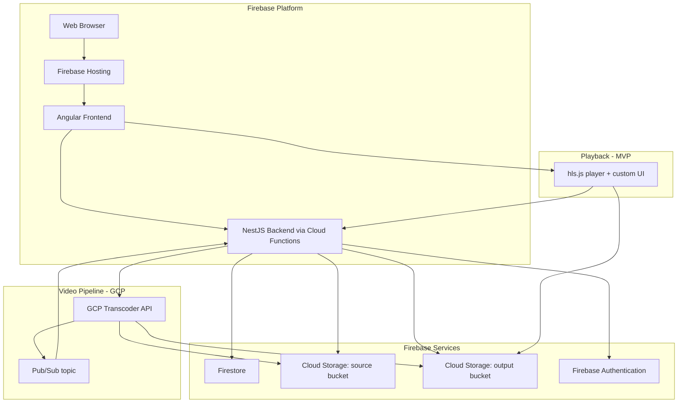

> [!NOTE]
> **DOCUMENT STATUS: DRAFT**
> This document is a living specification and is subject to change. All content is considered provisional until formally approved by project stakeholders.

# Technical Architecture: Learn Wren

This document outlines the recommended technical architecture for the Learn Wren platform. The architecture is designed to be modular, scalable, and self-hostable, using open-source technologies wherever possible.

---

## System Architecture Diagram

---

## Technology Stack

| Layer | Component | Recommended Technology | Rationale |
| :--- | :--- | :--- | :--- |
| **Workspace** | Monorepo Tooling | Nx (Nrwl) | Manages the monorepo, providing smart builds, caching, and code generation for both Angular and NestJS. |
| **Frontend** | Web Application | Angular | A comprehensive and opinionated framework that integrates well with NestJS and Nx for a consistent development experience. |
| **Backend** | API Server | NestJS | A progressive Node.js framework that uses TypeScript and is heavily inspired by Angular, ensuring architectural consistency. |
| **Database** | NoSQL Document Store | Firestore (via Firebase) | A flexible, scalable NoSQL database that integrates seamlessly with Firebase Authentication and Cloud Functions. |
| **Hosting & CDN** | Static & API Hosting | Firebase Hosting & Cloud Functions | Provides a serverless environment for hosting the Angular frontend and NestJS backend, with a built-in global CDN. |
| **Authentication** | Identity Provider | Firebase Authentication | Manages user sign-up, sign-in, and security rules, integrating directly with Firestore. |
| **File Storage** | Video & Lesson Materials | Cloud Storage for Firebase | Securely stores and delivers user-uploaded content like videos and PDFs, governed by Firebase security rules. |
| **Video Pipeline** | Transcoding | GCP Transcoder API (MVP); pluggable via the `VideoTranscoder` port — future swap to a self-hosted Cloud Run + FFmpeg + Shaka Packager worker for operators who want full self-host. | Same project, IAM, and billing as Firebase. Writes outputs to our own Cloud Storage bucket. Native AES-128 HLS encryption. Pay-per-use. |
| **Video Player** | Web Player | hls.js with a light custom UI (MVP). EME-ready for the future Widevine / PlayReady / FairPlay slice. | HLS-only player covers every modern browser (native on Safari / iOS, via JS-MSE elsewhere). Smallest viable bundle. No player swap needed for full-DRM migration. |

---

## Data Models

### User

| Field | Type | Description |
| :--- | :--- | :--- |
| `id` | UUID | Primary Key |
| `email` | String | Unique email address |
| `password_hash` | String | Hashed password |
| `display_name` | String | User's public name |
| `role` | Enum | `STUDENT`, `INSTRUCTOR`, `ADMIN` |
| `created_at` | Timestamp | ... |
| `updated_at` | Timestamp | ... |

### Course

| Field | Type | Description |
| :--- | :--- | :--- |
| `id` | UUID | Primary Key |
| `title` | String | ... |
| `description` | Text | ... |
| `instructor_id` | UUID | Foreign Key to User |
| `status` | Enum | `DRAFT`, `PUBLISHED`, `ARCHIVED` |
| `created_at` | Timestamp | ... |
| `updated_at` | Timestamp | ... |

### Module

| Field | Type | Description |
| :--- | :--- | :--- |
| `id` | UUID | Primary Key |
| `title` | String | ... |
| `course_id` | UUID | Foreign Key to Course |
| `order` | Integer | ... |
| `created_at` | Timestamp | ... |
| `updated_at` | Timestamp | ... |

### Lesson

| Field | Type | Description |
| :--- | :--- | :--- |
| `id` | UUID | Primary Key |
| `title` | String | ... |
| `module_id` | UUID | Foreign Key to Module |
| `video_id` | UUID | Foreign Key to Video (optional until a video is uploaded) |
| `order` | Integer | ... |
| `created_at` | Timestamp | ... |
| `updated_at` | Timestamp | ... |

### Video

| Field | Type | Description |
| :--- | :--- | :--- |
| `id` | UUID | Primary Key |
| `owner_instructor_id` | UUID | Foreign Key to User (denormalised for guard-time auth) |
| `course_id` | UUID | Foreign Key to Course (denormalised for cascade-delete) |
| `lesson_id` | UUID | Foreign Key to Lesson (current attachment; updated on replace-swap) |
| `state` | Enum | `PENDING_UPLOAD`, `UPLOADING`, `UPLOADED`, `TRANSCODING`, `READY`, `FAILED` |
| `source_bucket`, `source_path`, `source_size_bytes?` | ... | Source bucket object pointer |
| `output_bucket?`, `output_manifest_path?`, `output_duration_sec?` | ... | Output bucket object pointer (populated when `state === 'READY'`) |
| `transcoder_job_name?` | String | GCP Transcoder API job resource name |
| `key_id?` | UUID | Foreign Key to VideoKey |
| `failure_reason?` | String | Populated when `state === 'FAILED'` |
| `created_at` | Timestamp | ... |
| `updated_at` | Timestamp | ... |

### VideoKey

| Field | Type | Description |
| :--- | :--- | :--- |
| `id` | UUID | Primary Key |
| `video_id` | UUID | Foreign Key to Video |
| `key` | String | base64 of 16 bytes (AES-128) |
| `created_at` | Timestamp | ... |

### Enrollment

| Field | Type | Description |
| :--- | :--- | :--- |
| `id` | UUID | Primary Key |
| `user_id` | UUID | Foreign Key to User |
| `course_id` | UUID | Foreign Key to Course |
| `progress` | JSONB | Stores completion status of lessons |
| `created_at` | Timestamp | ... |
| `updated_at` | Timestamp | ... |

---

## DRM Strategy

MVP ships AES-128 HLS segment encryption with authenticated key delivery and signed segment URLs. Full multi-DRM (Widevine + PlayReady + FairPlay per US-03-03) is deferred to a post-MVP slice. The chosen player (hls.js) supports EME, so the future migration is a license-server endpoint plus DASH manifests — not a player replacement. See [`docs/superpowers/specs/2026-05-13-video-pipeline-architecture-design.md`](../superpowers/specs/2026-05-13-video-pipeline-architecture-design.md) §6 for what the reduced MVP bar claims and does not claim.
