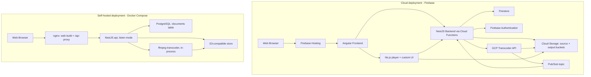

> [!NOTE]
> **DOCUMENT STATUS: DRAFT**
> This document is a living specification and is subject to change. All content is considered provisional until formally approved by project stakeholders.

# Technical Architecture: Learn Wren

This document outlines the recommended technical architecture for the Learn Wren platform. The architecture is designed to be modular, scalable, and self-hostable, using open-source technologies wherever possible.

---

## System Architecture Diagram

```mermaid
graph TD
    subgraph "Cloud deployment - Firebase"
        A[Web Browser] --> B[Firebase Hosting]
        B --> C[Angular Frontend]
        C --> D[NestJS Backend via Cloud Functions]
        D --> E[Firestore]
        D --> G[Firebase Authentication]
        D --> F[Cloud Storage: source + output buckets]
        D --> H[GCP Transcoder API]
        H --> F
        H --> P[Pub/Sub topic]
        P --> D
        C --> I[hls.js player + custom UI]
        I --> D
        I --> F
    end

    subgraph "Self-hosted deployment - Docker Compose"
        A2[Web Browser] --> N[nginx: web build + /api proxy]
        N --> D2[NestJS api, listen mode]
        D2 --> PG[PostgreSQL: documents table]
        D2 --> S3[S3-compatible store]
        D2 --> FF[ffmpeg transcoder, in-process]
        FF --> S3
    end
```

---

## Technology Stack

| Layer | Component | Recommended Technology | Rationale |
| :--- | :--- | :--- | :--- |
| **Workspace** | Monorepo Tooling | Nx (Nrwl) | Manages the monorepo, providing smart builds, caching, and code generation for both Angular and NestJS. |
| **Frontend** | Web Application | Angular | A comprehensive and opinionated framework that integrates well with NestJS and Nx for a consistent development experience. |
| **Backend** | API Server | NestJS | A progressive Node.js framework that uses TypeScript and is heavily inspired by Angular, ensuring architectural consistency. |
| **Database** | Document Store | Firestore in the cloud deployment; PostgreSQL (one path-keyed `documents` table of JSONB rows) for self-hosting — both behind the `DocumentStore` port (`libs/api-document-store`, US-09-04 Slice D), selected by `LEARNWREN_DATA_STORE=firestore\|postgres`. | Firestore is serverless and needs no operations work on Firebase. The port is the Firestore subset the api actually uses (equality/`in` queries, `orderBy`, `limit`, `count`, batches, transactions, `recursiveDelete`, one `collectionGroup`), so Postgres serves it as a document store with no relational redesign. |
| **Hosting & CDN** | Static & API Hosting | Firebase Hosting & Cloud Functions in the cloud deployment; Docker Compose (nginx + the api in listen mode) for self-hosting. | Serverless with a built-in global CDN in the cloud; one `docker compose up -d` on any machine when self-hosted. |
| **Authentication** | Identity Provider | Firebase Authentication in the cloud deployment; built-in api authentication for self-hosting (Node `crypto.scrypt` password hashes, opaque server-side sessions, single-use email tokens, all stored through the `DocumentStore` port) — both behind the `IdentityProvider` port in `libs/api-auth`, selected by `LEARNWREN_IDENTITY=firebase\|local`. | The browser never talks to the identity provider: it posts credentials to the api, which sets an HttpOnly session cookie. Swapping the provider is therefore an api-only change. Lockout, password policy and roles live in the api for both backends. |
| **File Storage** | Video & Lesson Materials | Cloud Storage for Firebase in the cloud deployment; any S3-compatible store (RustFS in the Compose stack; any S3-compatible store) for self-hosting — both behind the `ObjectStorage` port (`libs/api-object-storage`, US-09-04 Slice C). | Securely stores and delivers user-uploaded content like videos and PDFs. GCS mode uses signed URLs and Firebase security rules; S3 mode never exposes the store — uploads, downloads and public images all pass through the api. |
| **Video Pipeline** | Transcoding | GCP Transcoder API in the cloud deployment; ffmpeg in-process for self-hosting (US-09-04 Slice B) — both behind the `VideoTranscoder` port, selected by `LEARNWREN_VIDEO_TRANSCODER`. | Same project, IAM, and billing as Firebase in the cloud. Both produce the same AES-128 HLS layout (`hls-naming.ts`). |
| **Video Player** | Web Player | hls.js with a light custom UI (MVP). EME-ready for the future Widevine / PlayReady / FairPlay slice. | HLS-only player covers every modern browser (native on Safari / iOS, via JS-MSE elsewhere). Smallest viable bundle. No player swap needed for full-DRM migration. |

---

## Deployment Backends

Learn Wren runs on two sets of backends with one codebase. Every proprietary service sits behind a port with a cloud adapter and a self-hosted adapter, chosen by environment variable. Defaults select the cloud adapters, which the Firebase emulators also serve in local development. The Docker Compose stack selects all four self-hosted adapters (`postgres`, `local`, `s3`, `ffmpeg`) and runs no emulators.

| Port | Cloud adapter (learnwren.com) | Self-hosted adapter (Docker Compose) | Selector |
| :--- | :--- | :--- | :--- |
| `DocumentStore` | Firestore | PostgreSQL | `LEARNWREN_DATA_STORE` |
| `IdentityProvider` | Firebase Authentication | Built-in (api) | `LEARNWREN_IDENTITY` |
| `ObjectStorage` | Cloud Storage | S3-compatible store | `LEARNWREN_OBJECT_STORAGE` |
| `VideoTranscoder` | GCP Transcoder API | ffmpeg | `LEARNWREN_VIDEO_TRANSCODER` |

A contract test suite per port runs against every adapter; that suite is what keeps the two backends equivalent. Design: [`docs/superpowers/specs/2026-10-01-us-09-04-slice-d-auth-and-data-design.md`](../superpowers/specs/2026-10-01-us-09-04-slice-d-auth-and-data-design.md).

---

## Data Models

The tables below are logical entity definitions written with relational types. In both backends they are stored as documents: Firestore collections and subcollections, or rows of the PostgreSQL `documents` table keyed by the same path (`courses/{cid}/modules/{mid}/lessons/{lid}`). Translation rules (branded ID strings, ISO date strings, string-literal unions) are in `docs/superpowers/specs/2026-04-29-initial-nx-monorepo-design.md` §4.

### User

| Field | Type | Description |
| :--- | :--- | :--- |
| `id` | UUID | Primary Key |
| `email` | String | Unique email address |
| `password_hash` | String | Hashed password |
| `display_name` | String | User's public name |
| `role` | Enum | `STUDENT`, `INSTRUCTOR`, `ADMIN` |
| `created_at` | Timestamp | ... |
| `updated_at` | Timestamp | ... |

### Course

| Field | Type | Description |
| :--- | :--- | :--- |
| `id` | UUID | Primary Key |
| `title` | String | ... |
| `description` | Text | ... |
| `instructor_id` | UUID | Foreign Key to User |
| `status` | Enum | `DRAFT`, `PUBLISHED`, `ARCHIVED` |
| `created_at` | Timestamp | ... |
| `updated_at` | Timestamp | ... |

### Module

| Field | Type | Description |
| :--- | :--- | :--- |
| `id` | UUID | Primary Key |
| `title` | String | ... |
| `course_id` | UUID | Foreign Key to Course |
| `order` | Integer | ... |
| `created_at` | Timestamp | ... |
| `updated_at` | Timestamp | ... |

### Lesson

| Field | Type | Description |
| :--- | :--- | :--- |
| `id` | UUID | Primary Key |
| `title` | String | ... |
| `module_id` | UUID | Foreign Key to Module |
| `video_id` | UUID | Foreign Key to Video (optional until a video is uploaded) |
| `order` | Integer | ... |
| `created_at` | Timestamp | ... |
| `updated_at` | Timestamp | ... |

### Video

| Field | Type | Description |
| :--- | :--- | :--- |
| `id` | UUID | Primary Key |
| `owner_instructor_id` | UUID | Foreign Key to User (denormalised for guard-time auth) |
| `course_id` | UUID | Foreign Key to Course (denormalised for cascade-delete) |
| `lesson_id` | UUID | Foreign Key to Lesson (current attachment; updated on replace-swap) |
| `state` | Enum | `PENDING_UPLOAD`, `UPLOADING`, `UPLOADED`, `TRANSCODING`, `READY`, `FAILED` |
| `source_bucket`, `source_path`, `source_size_bytes?` | ... | Source bucket object pointer |
| `output_bucket?`, `output_manifest_path?`, `output_duration_sec?` | ... | Output bucket object pointer (populated when `state === 'READY'`) |
| `transcoder_job_name?` | String | GCP Transcoder API job resource name |
| `key_id?` | UUID | Foreign Key to VideoKey |
| `failure_reason?` | String | Populated when `state === 'FAILED'` |
| `created_at` | Timestamp | ... |
| `updated_at` | Timestamp | ... |

### VideoKey

| Field | Type | Description |
| :--- | :--- | :--- |
| `id` | UUID | Primary Key |
| `video_id` | UUID | Foreign Key to Video |
| `key` | String | base64 of 16 bytes (AES-128) |
| `created_at` | Timestamp | ... |

### Enrollment

| Field | Type | Description |
| :--- | :--- | :--- |
| `id` | UUID | Primary Key |
| `user_id` | UUID | Foreign Key to User |
| `course_id` | UUID | Foreign Key to Course |
| `progress` | JSONB | Stores completion status of lessons |
| `created_at` | Timestamp | ... |
| `updated_at` | Timestamp | ... |

---

## DRM Strategy

MVP ships AES-128 HLS segment encryption with authenticated key delivery and signed segment URLs. Full multi-DRM (Widevine + PlayReady + FairPlay per US-03-03) is deferred to a post-MVP slice. The chosen player (hls.js) supports EME, so the future migration is a license-server endpoint plus DASH manifests — not a player replacement. See [`docs/superpowers/specs/2026-05-13-video-pipeline-architecture-design.md`](../superpowers/specs/2026-05-13-video-pipeline-architecture-design.md) §6 for what the reduced MVP bar claims and does not claim.
