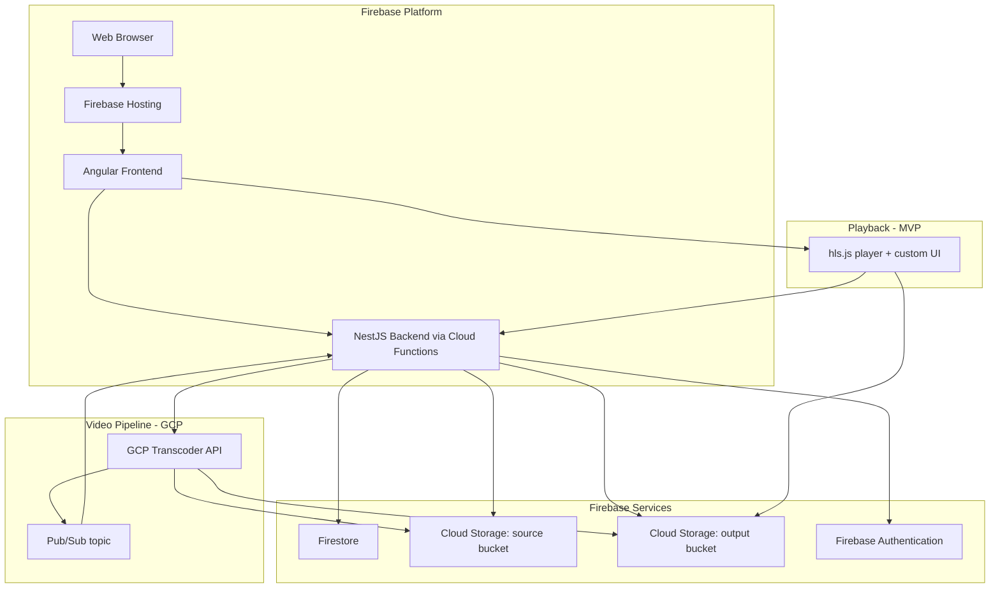

# Video Pipeline Architecture (EP-03) Design Spec

> [!NOTE]
> **DOCUMENT STATUS: DRAFT**
> This document is a living specification and is subject to change. All content is considered provisional until formally approved by project stakeholders.

**Status:** Draft (2026-05-13)
**Scope:** Architecture-level decision spec for EP-03 (Video Management and DRM). Locks the provider stack, data model shape, library boundaries, bucket layout, event flow, and reduced-DRM bar for MVP. Defines a sub-slice dependency graph (A → B → C → D plus cross-cutting E, F) that subsequent design specs will fill in one slice at a time. **This spec does not ship code.** It produces decisions and updates to `docs/epics/TECHNICAL_ARCHITECTURE.md` and a note in `docs/superpowers/specs/2026-03-27-mvp-use-cases-design.md`.

Builds on the EP-01 auth slices and the EP-02 course-authoring slice (`2026-05-12-course-authoring-design.md`). Preserves their chokepoint posture: every read and write of `videos/**` and `videoKeys/**` Firestore paths goes through the NestJS API; Firestore rules are deny-all from the client.

## Goal

After this spec is approved and the doc edits land, the following must be true:

- `docs/epics/TECHNICAL_ARCHITECTURE.md` reflects the GCP Transcoder API + hls.js + AES-128 HLS stack, the split source/output bucket layout, the Pub/Sub event path, and the new `Video` + `VideoKey` entities. Its Mermaid diagram parses and renders.
- `docs/superpowers/specs/2026-03-27-mvp-use-cases-design.md` carries a footnote on UC-03-03 / UC-03-04 noting the reduced MVP DRM bar.
- The sub-slice sequence (A → B → C → D) is documented here so each subsequent design spec has an unambiguous predecessor.
- The `VideoTranscoder` port shape, the bucket organisation, and the Pub/Sub event envelope are decided to a level of detail that any of the four slices can be brainstormed without re-litigating provider choice.

That is the contract this spec delivers.

## Non-Goals

These are out of scope for this spec and will be addressed in sub-slice design specs (or later epics):

- **Any code, library scaffold, generator invocation, or Firestore-rules edit.** This spec produces decisions and doc updates only.
- **Slice A (Video Upload).** US-03-01 main success scenario. Will be the next design spec after this one lands.
- **Slice B (Transcoding + AES-128 key generation).** US-03-02 + collapsed US-03-03 (reduced DRM bar).
- **Slice C (Owner playback in editor).** Scoped subset of US-03-04: manifest + key endpoints with owner-only guard.
- **Slice D (Publish gate + state machine).** The deferred US-02-04 from the EP-02 spec. Lands after a `Video` can reach the `READY` state.
- **Slice E (Notifications).** US-03-01 / US-03-02 / US-03-03 in-app + email notifications. Cross-cutting; ordered later.
- **Slice F (Soft-delete, retention, replace cleanup).** Partial US-03-05 (admin panel deferred with EP-08).
- **Full multi-DRM (Widevine + PlayReady + FairPlay).** The original US-03-03. Deferred to a post-MVP slice. The MVP stack is EME-compatible so the future migration is config + new endpoints, not a player replacement.
- **MPEG-DASH manifests.** DASH only meaningfully helps when paired with Widevine/PlayReady. Adds at full-DRM time.
- **CDN in front of Cloud Storage.** Direct signed-URL reads from Cloud Storage are adequate for early scale. Revisit when load demands.
- **Admin storage panel (UC-03-05 main scenario).** Bound to EP-08.
- **Enrollment-aware playback.** EP-06.
- **Replace flow (UC-03-01 extension 1a).** Atomic-swap state machine is meaningful additional design surface; lands in slice A.1 or its own slice within EP-03.
- **License server, key wrapping in KMS, per-video key rotation.** All belong to the future multi-DRM slice.

## 1. Stack

The video pipeline for MVP:

| Concern | MVP choice | Deferred to later slice |
|---|---|---|
| Source upload | Resumable upload to Cloud Storage source bucket, instructor-only | — |
| Transcoder | GCP Transcoder API | Cloud Run worker (FFmpeg + Shaka Packager) as swap option |
| Output formats | HLS, 1080p / 720p / 480p / 360p ladder, skip upscale | DASH (lands with Widevine) |
| Output storage | Cloud Storage output bucket, private | — |
| Content protection | AES-128 HLS segment encryption, per-video key | Widevine + PlayReady + FairPlay multi-DRM |
| Key storage | `videoKeys/{keyId}` Firestore collection, rules deny-all | KMS-wrapped keys |
| Key delivery | Authenticated NestJS endpoint, checks auth + (enrolled or owner) | License-server-based delivery |
| Manifest delivery | NestJS-mediated: signs segment URLs on request | Edge-signed via Cloud CDN |
| Segment delivery | Cloud Storage v4 signed URLs, ~4h TTL | Cloud CDN with signed cookies |
| Player | hls.js + light custom UI | (no change; hls.js supports EME for future Widevine) |
| Transcoder → app event | Pub/Sub topic, push subscription to NestJS endpoint | — |
| Pluggability | `VideoTranscoder` port in `libs/api-video`, single GCP impl | Cloud Run impl, Mux impl |

### 1.1 Architecture diagram

```
┌─────────────────────────────────────────────────────────────────────────────┐
│                              Firebase Platform                              │
│                                                                             │
│  ┌──────────────┐    ┌───────────────────┐    ┌────────────────────────┐    │
│  │ Web Browser  │ ─► │ Firebase Hosting  │ ─► │ Angular Frontend       │    │
│  │              │    │                   │    │  - web-courses         │    │
│  │              │    │                   │    │  - web-video (NEW)     │    │
│  └──────────────┘    └───────────────────┘    └──────────┬─────────────┘    │
│                                                          │                  │
│                                                          ▼                  │
│                                              ┌────────────────────────┐     │
│                                              │ NestJS via Functions   │     │
│                                              │  - api-courses         │     │
│                                              │  - api-video (NEW)     │     │
│                                              └────────┬───────────────┘     │
│                                                       │                     │
└───────────────────────────────────────────────────────┼─────────────────────┘
                                                        │
                       ┌────────────────────────────────┼────────────────────┐
                       │                                │                    │
                       ▼                                ▼                    ▼
            ┌─────────────────────┐    ┌─────────────────────┐    ┌──────────────────┐
            │ Firestore           │    │ Cloud Storage       │    │ GCP Transcoder   │
            │  videos/            │    │  - source bucket    │ ─► │ API              │
            │  videoKeys/         │    │  - output bucket    │ ◄─ │                  │
            │  (rules: deny-all)  │    │  (private, signed)  │    └─────────┬────────┘
            └─────────────────────┘    └─────────────────────┘              │
                                                                            │
                                                                            ▼
                                                                  ┌──────────────────┐
                                                                  │ Pub/Sub topic    │
                                                                  │ (job completion) │
                                                                  └─────────┬────────┘
                                                                            │
                                                          push subscription │
                                                                            ▼
                                                              ┌──────────────────────┐
                                                              │ NestJS              │
                                                              │ webhook controller   │
                                                              │ (advances state)     │
                                                              └──────────────────────┘
```

### 1.2 End-to-end data flow

Upload:
1. Instructor clicks "Upload Video" on a lesson in the editor.
2. `web-video` requests a resumable upload session: `POST /api/lessons/:lid/video/upload-session`.
3. NestJS creates a `Video` doc in `PENDING_UPLOAD`, mints a Cloud Storage v4 signed resumable session URI for the source bucket (with `x-goog-content-length-range` ≤10 GB and `Content-Type: video/*`), returns it.
4. Browser streams bytes directly to Cloud Storage via the session URI. `Video.state` moves to `UPLOADING` on first byte (client-reported) and `UPLOADED` on session completion (client-reported, server-verified by polling object existence).

Transcode:
5. On `UPLOADED`, NestJS generates 16 bytes of AES-128, writes a `VideoKey` doc, submits a GCP Transcoder API job. `Video.state` moves to `TRANSCODING`.
6. Transcoder reads from source bucket, writes encrypted HLS outputs to the output bucket under `videos/{videoId}/hls/`, publishes a completion event to a Pub/Sub topic.

Webhook:
7. Pub/Sub push subscription POSTs to `/api/internal/transcoder-events` with an OIDC-signed JWT.
8. `PubSubPushGuard` verifies issuer, audience, and the dedicated invoker SA.
9. Controller parses event, advances `Video.state` to `READY` (with `output.manifestPath` and `output.durationSec`) or `FAILED` (with `failureReason`).

Playback (owner-only in slice C):
10. Player requests `GET /api/playback/manifest/:videoId`. NestJS verifies owner-or-enrolled, fetches the m3u8 from output bucket, rewrites segment URIs to v4 signed URLs (~4h TTL), returns the rewritten manifest.
11. Player requests `GET /api/playback/keys/:videoId`. NestJS verifies the same guard, returns key bytes.
12. hls.js plays the manifest, fetches segments via signed URLs, decrypts with the key.

## 2. Data Model

### 2.1 `libs/shared-data-models` additions

`Video` is a new top-level entity (not a subcollection of Lesson). Reason: UC-03-01 extension 1a requires keeping the old video until the replacement reaches `READY` (atomic swap). Replace, retain-source, and soft-delete stories all become awkward if videos live inside a lesson.

```ts
export type VideoState =
  | 'PENDING_UPLOAD'   // shell created; signed upload URI issued; bytes not yet received
  | 'UPLOADING'        // resumable upload in progress (client-reported)
  | 'UPLOADED'         // source bytes confirmed in source bucket; not yet queued for transcoding
  | 'TRANSCODING'      // GCP Transcoder API job submitted
  | 'READY'            // manifest written to output bucket; AES key persisted
  | 'FAILED';          // terminal failure; failureReason populated

export interface Video {
  id: VideoId;
  ownerInstructorId: UserId;
  courseId: CourseId;
  lessonId: LessonId;
  state: VideoState;
  source: {
    bucket: string;
    path: string;
    sizeBytes?: number;
  };
  output?: {
    bucket: string;
    manifestPath: string;
    durationSec: number;
  };
  transcoderJobName?: string;
  keyId?: VideoKeyId;
  failureReason?: string;
  createdAt: ISODateString;
  updatedAt: ISODateString;
}

export interface VideoKey {
  id: VideoKeyId;
  videoId: VideoId;
  key: string;        // base64 of 16 bytes (AES-128)
  createdAt: ISODateString;
}
```

`ownerInstructorId` and `courseId` are denormalised onto `Video` so authorisation guards do not have to traverse Lesson → Module → Course on every request.

### 2.2 `Lesson` shape change

The EP-02 spec relaxed `Lesson.videoUrl` to optional with a note that "EP-03 will tighten this back". This spec drops `videoUrl` entirely in favour of `videoId`:

```ts
export interface Lesson {
  id: LessonId;
  moduleId: ModuleId;
  title: string;
  description?: string;
  videoId?: VideoId;        // CHANGED — was videoUrl?: string
  order: number;
  createdAt: ISODateString;
  updatedAt: ISODateString;
}
```

The actual code change happens in slice A (when `videoId` is first written). No EP-02 user-facing behaviour shifts at that point — `videoId` is null until a video is uploaded, matching the current null `videoUrl`.

### 2.3 Firestore document layout

```
videos/{videoId}
  ownerInstructorId, courseId, lessonId, state, source{},
  output?{}, transcoderJobName?, keyId?, failureReason?,
  createdAt, updatedAt

videoKeys/{keyId}
  videoId, key, createdAt
```

Both are top-level collections, not nested under `courses/`. Rationale: querying `videos` by `ownerInstructorId` (for instructor dashboards), by `courseId` (for cascade delete from `api-courses`), and by `lessonId` (for the editor) is single-field on each path; subcollections would force `collectionGroup` queries and complicate the indexing.

### 2.4 Firestore security rules

`firestore.rules` will add (in slice A; not in this spec):

```
match /videos/{videoId} {
  allow read, write: if false;
}
match /videoKeys/{keyId} {
  allow read, write: if false;
}
```

The deny-all is the chokepoint that forces every access through `api-video`. Slice A will add a rules-unit test asserting denial against student, instructor, and anonymous principals — mirroring the `auth_attempts` deny-all suite from the auth-hardening slice.

## 3. Library Structure

Following the existing per-feature pattern (`api-auth` / `web-auth`, `api-courses` / `web-courses`):

```
libs/
├── api-video/                       # NEW
│   ├── src/lib/
│   │   ├── video.module.ts
│   │   ├── video.controller.ts          # POST /api/lessons/:lid/video/upload-session, GET, DELETE
│   │   ├── video.service.ts             # state-machine transitions, key generation
│   │   ├── video.repository.ts          # Firestore CRUD over videos/ + videoKeys/
│   │   ├── transcoder.port.ts           # VideoTranscoder interface (port)
│   │   ├── gcp-transcoder.adapter.ts    # impl using @google-cloud/video-transcoder
│   │   ├── manifest.controller.ts       # GET /api/playback/manifest/:videoId
│   │   ├── manifest.service.ts          # fetch m3u8, rewrite segment URIs → signed URLs
│   │   ├── key.controller.ts            # GET /api/playback/keys/:videoId
│   │   ├── key.service.ts               # auth-gated key bytes delivery
│   │   ├── webhook.controller.ts        # POST /api/internal/transcoder-events
│   │   ├── pubsub-push.guard.ts         # OIDC JWT verification for Pub/Sub push
│   │   ├── video-owner.guard.ts         # mutations: must own the video
│   │   └── enrollment-or-owner.guard.ts # playback: enrolled (EP-06) or owner (slice C)
│   └── ...
├── web-video/                       # NEW
│   ├── src/lib/
│   │   ├── upload/
│   │   │   ├── video-upload.component.ts
│   │   │   ├── video-upload.service.ts      # resumable-upload state machine
│   │   │   └── upload-progress.component.ts
│   │   ├── player/
│   │   │   ├── video-player.component.ts    # hls.js wrapper + light UI
│   │   │   └── playback.service.ts
│   │   └── video.service.ts                 # HTTP wrapper for /api/videos/*
│   └── ...
└── shared-data-models/              # MODIFIED (slice A)
    └── src/lib/types.ts             # add Video, VideoKey, VideoState, VideoId, VideoKeyId
```

### 3.1 Integration with existing libs

- **`libs/web-courses` `LessonItem`** renders `VideoUploadComponent` (from `libs/web-video`) when `lesson.videoId == null`, otherwise a thumbnail/state badge plus a "Replace" affordance (replace flow itself is a later slice).
- **`libs/web-learning`** (future, EP-06) consumes `VideoPlayerComponent`. Out of scope here.
- **`libs/api-courses` lesson-delete handler** must call `VideoService.deleteForLesson(lessonId)` so deleting a lesson cascades to its attached video and key. Slice A adds the thin cross-lib method.

### 3.2 `VideoTranscoder` port

Small, video-shaped (not a generic job runner):

```ts
export interface VideoTranscoder {
  submitJob(input: TranscoderJobInput): Promise<TranscoderJobHandle>;
  parseEvent(rawPubSubMessage: unknown): TranscoderEvent;
}

export interface TranscoderJobInput {
  videoId: VideoId;
  sourceUri: string;                                  // gs://...
  outputUriPrefix: string;                            // gs://.../videos/{videoId}/hls/
  encryptionKey: { id: string; bytes: Uint8Array };   // AES-128, 16 bytes
}

export interface TranscoderJobHandle {
  jobName: string;
}

export type TranscoderEvent =
  | { type: 'JOB_SUCCEEDED'; jobName: string; manifestPath: string; durationSec: number }
  | { type: 'JOB_FAILED';    jobName: string; reason: string };
```

Single MVP implementation: `GcpTranscoderAdapter`, using `@google-cloud/video-transcoder` for `submitJob` and parsing the Transcoder API Pub/Sub event payload in `parseEvent`. A future Cloud Run worker implementation emits the same `TranscoderEvent` envelope onto the same Pub/Sub topic, so the swap is a config change — not a rewrite. A future Mux implementation can also conform if we ever want that path.

The port deliberately does not include a `getStatus(jobName)` method: events drive state, not polling. If we ever need a reconciliation loop, it lands as a separate concern.

## 4. Bucket Layout

| Bucket | Purpose | Tier (MVP) | Public? | Lifecycle |
|---|---|---|---|---|
| `${project}-video-source` | Original uploads (one file per video, written by client via signed resumable session URI) | Standard | No — signed-URL writes only | None in MVP. Slice F may add Coldline transition + 30-day soft-delete. Cloud Storage's built-in incomplete-upload cleanup (default ~7 days) handles abandoned resumables. |
| `${project}-video-output` | Transcoded HLS playlists + segments (written by Transcoder API) | Standard | No — signed-URL reads via NestJS | None in MVP. Slice F may add lifecycle for orphans. |

Both buckets are private — no public IAM. The Transcoder service account is granted Storage Object Viewer on the source bucket and Storage Object Creator on the output bucket. NestJS is granted Storage Object Admin on both (it mints signed URLs).

Object path conventions:
- Source: `gs://${project}-video-source/videos/{videoId}/source.{ext}` (ext determined by the upload session content type)
- Output: `gs://${project}-video-output/videos/{videoId}/hls/manifest.m3u8` plus segments under `videos/{videoId}/hls/{rendition}/`

The instructor never sees these paths. They are an implementation detail of the storage layout and may evolve.

## 5. Pub/Sub Event Flow

GCP Transcoder API can be configured to publish job state changes to a Pub/Sub topic. We provision a single topic per environment, e.g. `learn-wren-transcoder-events-dev` and `learn-wren-transcoder-events-prod`.

A push subscription on each topic targets the deployed NestJS endpoint:

- **Endpoint:** `POST /api/internal/transcoder-events` (the `/api/internal/` prefix marks the route as machine-to-machine, never reachable from the SPA's HTTP client).
- **Auth header:** Google-signed OIDC JWT in `Authorization: Bearer <token>`, audience set to the endpoint URL, signed by the dedicated invoker service account.
- **`PubSubPushGuard`** verifies issuer = `https://accounts.google.com`, audience matches the configured endpoint URL, email matches the configured invoker SA email, and the token is not expired.
- **Idempotency:** Pub/Sub may deliver the same event more than once. The webhook controller treats event handling as idempotent — advancing `Video.state` to `READY` or `FAILED` from `TRANSCODING` is allowed; advancing from `READY` to `READY` is a no-op; advancing from a non-`TRANSCODING` state to anything else logs and discards. The video's existing `transcoderJobName` is the dedup key matched against the event.

This same wiring serves a future Cloud Run worker implementation — that worker would publish identically shaped events to the same topic.

## 6. Reduced DRM Bar — What We Claim and Don't

US-03-04's acceptance criteria include "the player must prevent right-click download and screenshot capture (via Encrypted Media Extensions)". That guarantee requires a real DRM CDM (Widevine / PlayReady / FairPlay). The MVP stack cannot honour it. To avoid future surprise, this spec is explicit about the protection model we are claiming.

**What MVP AES-128 HLS protection delivers:**
- ✓ Segments are encrypted at rest in the output bucket and in transit to the player.
- ✓ The AES-128 key is delivered only via an authenticated NestJS endpoint. Unauthenticated clients cannot retrieve it.
- ✓ Manifests and segment URLs are v4-signed and time-limited (~4h TTL). They cannot be hotlinked indefinitely.
- ✓ Source files in the source bucket are not directly served. They exist only for transcoding and (future) re-processing.

**What it does not deliver:**
- ✗ A determined user with browser dev tools can read the AES-128 key from the running player's memory and decrypt segments offline. This is intrinsic to in-band key delivery without a hardware CDM.
- ✗ Screen-capture is not prevented. There is no secure media pipeline.
- ✗ The "no decryption key exposed in any browser-accessible context" clause of US-03-04 is partially honoured (no `.key` URL or DRM license metadata is exposed in the manifest, but the key bytes themselves traverse a JS-accessible HTTPS response).

**Migration path:** The future multi-DRM slice replaces the key endpoint with a license-server flow (Widevine / PlayReady / FairPlay), adds DASH manifests with `ContentProtection` elements, and uses the same hls.js + EME path on the player. Existing API surfaces (`/api/playback/manifest/:videoId`, `/api/internal/transcoder-events`) are reusable. The `VideoTranscoder` port grows a `drmConfig` field. The `VideoKey` schema migrates.

This is documented here once, in this spec, so each slice spec downstream can reference rather than restate.

## 7. Sub-slice Sequencing

This spec produces decisions for an epic that ships in slices. Each slice gets its own design spec, brainstormed and approved separately. Dependency graph:

```
A (Upload)  →  B (Transcode + key gen)  →  C (Owner playback)  →  D (Publish gate)
                                       ↘                       ↗
                                          E (Notifications, cross-cutting through A & B)
                                          F (Soft-delete / retention / replace cleanup)
```

| Slice | Brief | Maps to | Status after |
|---|---|---|---|
| **A** | Resumable upload to source bucket, `Video` doc lifecycle from `PENDING_UPLOAD` to `UPLOADED`, upload-progress UI, `videoId` written onto Lesson, cascade-delete from Lesson. | US-03-01 main success | Lessons have uploaded sources; nothing plays yet. |
| **B** | On `UPLOADED`, generate AES-128 key, submit Transcoder job, advance through `TRANSCODING` → `READY` / `FAILED` via Pub/Sub webhook. | US-03-02 + collapsed US-03-03 (reduced bar) | Lessons have HLS manifests and encryption keys, but nothing plays them yet. |
| **C** | Manifest + key endpoints with owner-only guard, `VideoPlayerComponent` in the editor's `LessonItem`. | Scoped subset of US-03-04 | Instructors can preview their videos. Publish gate now has a checkable `READY` state. |
| **D** | Publish / unpublish / archive UI controls and the publish gate (`every lesson has a video.state === 'READY'`). | US-02-04 | Courses can be published. (Visibility in catalogue still requires EP-05.) |
| **E** | In-app + email notifications on upload-complete, transcoding-complete, transcoding-failed. Cross-cutting; threaded through A and B but can be deferred. | US-03-01 / US-03-02 / US-03-03 notification ACs | Instructors are notified rather than polling the editor. |
| **F** | 30-day soft-delete with Coldline source bucket, replace-orphan cleanup. Admin panel deferred with EP-08. | Partial US-03-05 | Storage costs bounded; replace flow safe. |

**Order I recommend** for shipping publish end-to-end: **A → B → C → D**. Slice C is small and gives instructors confidence that videos play before publish becomes meaningful. E and F can land whenever — they do not block publish.

## 8. Doc Updates

This spec triggers the following edits to existing documents. The edits land alongside this spec's approval, not later.

### 8.1 `docs/epics/TECHNICAL_ARCHITECTURE.md`

Four changes:

**(a) Mermaid system architecture diagram.** Replace the current diagram. New version:



Validate the syntax — commit `d6600fb` previously fixed a parse error in this diagram, so the edit must keep the doc rendering on GitHub.

**(b) Tech stack table.** Two rows change:

| Layer | Component | Recommended Technology (revised) | Rationale |
|---|---|---|---|
| Video Pipeline | Transcoding | GCP Transcoder API (MVP); `VideoTranscoder` port allows future swap to a self-hosted Cloud Run + FFmpeg + Shaka Packager worker for operators who want full self-host. | Same project, IAM, and billing as Firebase. Writes outputs to our own Cloud Storage bucket. Native AES-128 HLS encryption. Pay-per-use. |
| Video Player | Web Player | hls.js with a light custom UI (MVP). EME-ready for future Widevine / PlayReady / FairPlay slice. | HLS-only player covers every modern browser (native on Safari / iOS, via JS-MSE elsewhere). Smallest viable bundle. No player swap needed for full-DRM migration. |

**(c) Data Models section.** Add `Video` and `VideoKey`; update `Lesson` (drop `video_url`, add `video_id`):

```
Video
| Field                | Type    | Description                                  |
| id                   | UUID    | Primary Key                                  |
| owner_instructor_id  | UUID    | Foreign Key to User (denormalised)           |
| course_id            | UUID    | Foreign Key to Course (denormalised)         |
| lesson_id            | UUID    | Foreign Key to Lesson (current attachment)   |
| state                | Enum    | PENDING_UPLOAD, UPLOADING, UPLOADED,         |
|                      |         | TRANSCODING, READY, FAILED                   |
| source_bucket, source_path, source_size_bytes? | ... | source bucket object pointer |
| output_bucket?, output_manifest_path?, output_duration_sec? | ... | output bucket object pointer |
| transcoder_job_name? | String  | GCP Transcoder API job resource name         |
| key_id?              | UUID    | Foreign Key to VideoKey                      |
| failure_reason?      | String  | Populated when state === 'FAILED'            |
| created_at, updated_at                                                      |

VideoKey
| Field      | Type    | Description                                            |
| id         | UUID    | Primary Key                                            |
| video_id   | UUID    | Foreign Key to Video                                   |
| key        | String  | base64 of 16 bytes (AES-128)                           |
| created_at                                                                  |
```

`Lesson.video_url` → drop. `Lesson.video_id` → add (FK to Video).

**(d) New "DRM Strategy" subsection** (~100 words) directly under Data Models. Content:

> MVP ships AES-128 HLS segment encryption with authenticated key delivery and signed segment URLs. Full multi-DRM (Widevine + PlayReady + FairPlay per US-03-03) is deferred to a post-MVP slice. The chosen player (hls.js) supports EME, so the future migration is a license-server endpoint plus DASH manifests — not a player replacement. See `docs/superpowers/specs/2026-05-13-video-pipeline-architecture-design.md` §6 for what the reduced MVP bar claims and does not claim.

### 8.2 `docs/superpowers/specs/2026-03-27-mvp-use-cases-design.md`

Add a footnote under UC-03-03 / UC-03-04 in the MVP scope table:

> UC-03-03 and UC-03-04 ship in MVP with a reduced DRM bar: AES-128 HLS segment encryption, no commercial DRM, no license server. The full multi-DRM realisation of these use cases is deferred to a post-MVP slice. See `2026-05-13-video-pipeline-architecture-design.md` for the protection-claim breakdown.

No other MVP-scope changes — both use cases remain in MVP; only the implementation is reduced.

### 8.3 No edits to

- `docs/epics/00-vision-and-epics.md` — index only.
- `docs/epics/03-video-management-and-drm.md` — the epic is aspirational; MVP-vs-deferred slicing belongs in design specs, not the epic.
- `docs/use-cases/03-video-management-and-drm.md` — use cases describe end state; implementation deltas belong in design specs.
- `docs/epics/09-non-functional-requirements.md` — no DRM-specific NFR worth touching at this layer.

## 9. Locked Decisions

These decisions are settled at the architecture level so sub-slice specs can reference rather than re-litigate:

1. **Output ladder skips upscale.** Transcoder API configured so a 480p source produces only 480p + 360p outputs, not the full ladder. Saves cost; avoids fake-quality renditions.
2. **Failure recovery is re-upload, not retry.** A `Video` in `FAILED` is terminal. The instructor creates a new `Video` by uploading again. No in-place retry button. Orphaned `FAILED` sources are cleaned up by slice F.
3. **Upload size + format enforcement is at the signed-URL layer.** `x-goog-content-length-range` ≤10 GB and a MIME prefix condition (`video/*`) live in the v4 signed resumable session URI. Anything past those gates that Transcoder rejects (e.g., unsupported codec inside a `video/*` container) advances `Video.state` to `FAILED` with `failureReason: 'UNSUPPORTED_CODEC'`.
4. **Resumable session is fire-and-forget.** Server mints the URI and does not store it. Client owns resumption; Cloud Storage owns expiry (~1 week default) and incomplete-upload cleanup.
5. **Key delivery is plain HTTPS to an authenticated endpoint.** TLS is the protection. Standard AES-128 HLS pattern.
6. **Playback guard is composable.** `EnrollmentOrOwnerGuard` accepts a video and a requester. Owner mode lands in slice C; enrolled mode lands in EP-06. The guard signature does not change between slices.
7. **Manifest delivery is NestJS-mediated.** NestJS fetches the m3u8 from the output bucket on each request and rewrites segment URIs to signed URLs. The output bucket is never directly browsable. Manifests are not statically published.
8. **Pub/Sub event handling is idempotent.** State transitions from `TRANSCODING` to `READY` / `FAILED` are allowed; re-deliveries of the same event are no-ops; events for unknown `transcoderJobName` are logged and discarded.
9. **Source files are kept indefinitely in MVP.** No lifecycle rule. Slice F introduces Coldline transition + 30-day soft delete.
10. **No CDN in front of Cloud Storage in MVP.** Direct signed-URL reads. Add CDN when load demands.

## 10. Open Questions

None at the architecture-decision level. Resolved during brainstorming:

- **MVP DRM bar?** → AES-128 HLS, no commercial DRM (resolved §6).
- **Transcoder provider?** → GCP Transcoder API (resolved §1).
- **Player?** → hls.js with light custom UI (resolved §1).
- **DASH in MVP?** → No; lands with Widevine (resolved §1).
- **Video entity placement?** → Top-level `videos/` collection, not a subcollection of Lesson (resolved §2.1).
- **Source-bucket / output-bucket organisation?** → Two separate private buckets (resolved §4).
- **Transcoder → app notification mechanism?** → Pub/Sub topic with push subscription to a NestJS endpoint (resolved §5).
- **Manifest delivery model?** → NestJS-mediated with v4 signed segment URLs (~4h TTL) (resolved §1.2 / §9.7).
- **Key delivery model?** → Authenticated `GET /api/playback/keys/:videoId` returning raw key bytes over TLS (resolved §1.2 / §9.5).
- **Pluggability layer?** → `VideoTranscoder` port with single GCP implementation in MVP (resolved §3.2).
- **Replace flow timing?** → Out of this spec; lands in slice A.1 or its own EP-03 slice (resolved §7 / Non-Goals).

## 11. Acceptance Bar

Before this architecture spec is "done":

1. `docs/epics/TECHNICAL_ARCHITECTURE.md` is updated per §8.1, the Mermaid diagram renders on GitHub without parse errors, and the data-models tables include `Video` and `VideoKey`.
2. `docs/superpowers/specs/2026-03-27-mvp-use-cases-design.md` carries the §8.2 footnote.
3. This spec's status moves from Draft to Approved after stakeholder review.
4. The first downstream design spec (slice A — Video Upload) can be brainstormed without re-opening any of the questions in §10.
